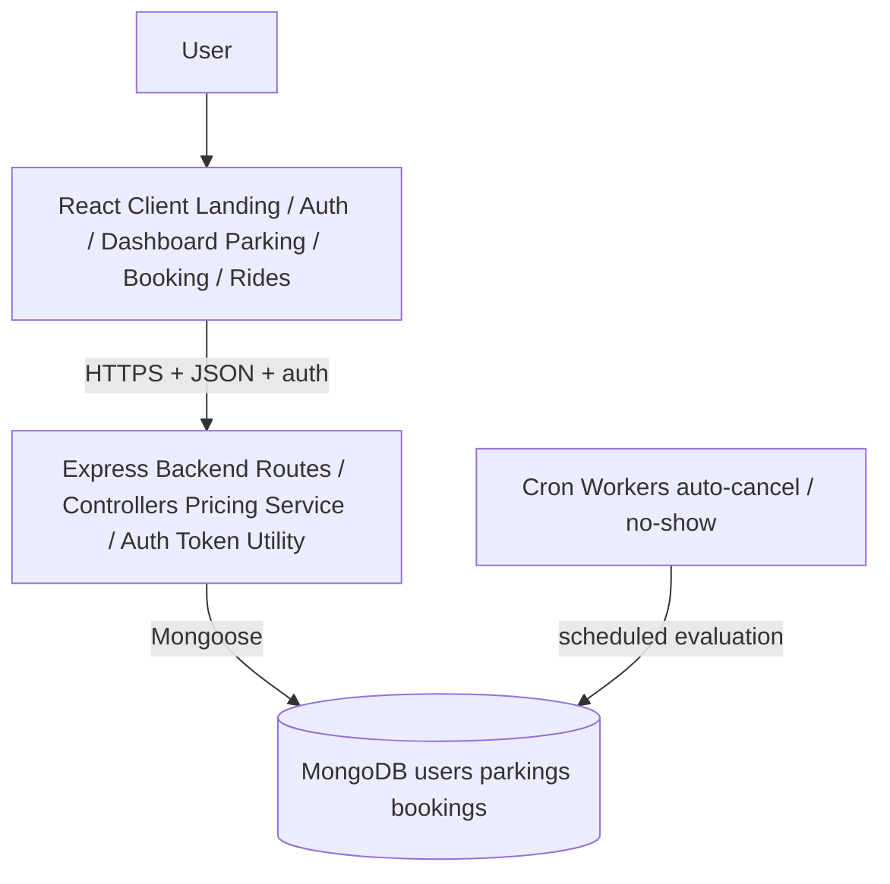
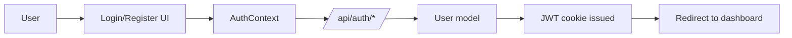
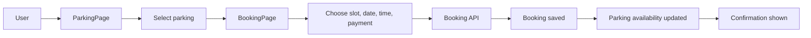
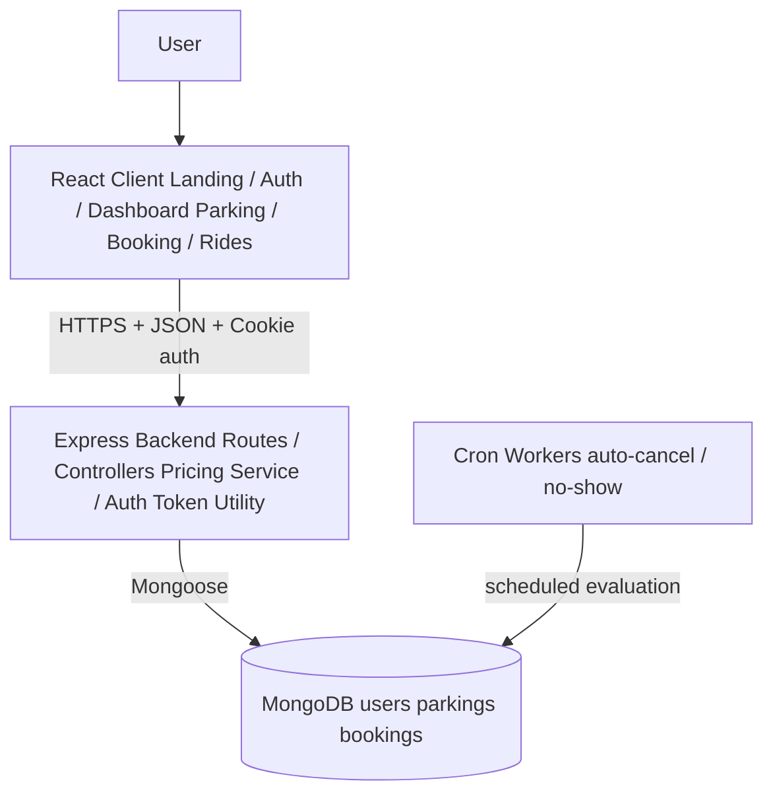
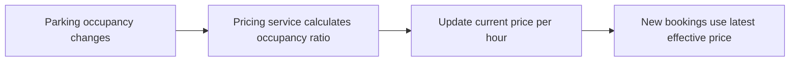
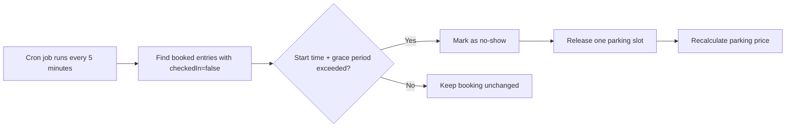
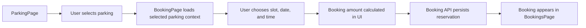
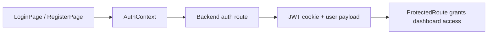
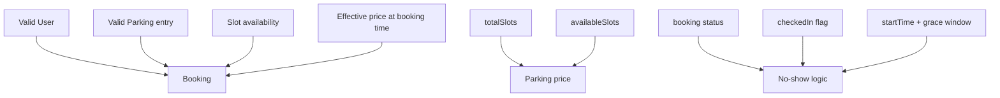
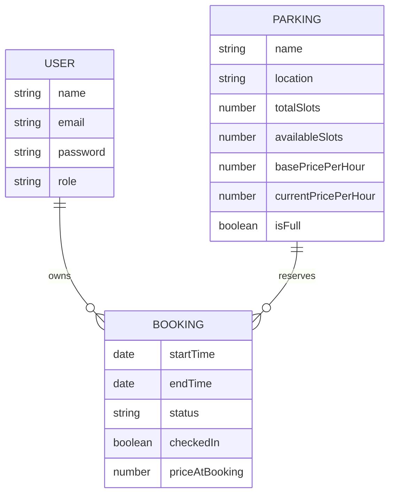

# Park & Ride

Park & Ride is a smart mobility platform that combines parking reservation with last-mile commute support. This repository currently contains a React frontend and a Node.js/Express backend with MongoDB models for users, parking inventory, and bookings.

## Overview

The product goal is to help commuters:

- discover nearby parking locations
- reserve a parking slot before arrival
- complete a guided booking and payment flow
- manage bookings from a user dashboard
- extend the journey with last-mile ride options

The codebase already implements:

- frontend flows for landing, auth, parking discovery, booking, rides, bookings, and profile
- backend auth APIs for signup, login, and logout
- MongoDB domain models for `User`, `Parking`, and `Booking`
- pricing logic based on parking occupancy
- a cron job design for converting missed check-ins into `no-show`

## Tech Stack

| Layer | Technology |
| --- | --- |
| Frontend | React, React Router, Vite, Tailwind CSS, Framer Motion |
| Backend | Node.js, Express.js |
| Database | MongoDB with Mongoose |
| Authentication | JWT stored in HTTP-only cookie |
| Scheduling | Cron worker design present in codebase; package wiring still pending |
| UI | Custom component library under `client/src/components/ui` |

## Repository Structure

```text
client/
  src/
    components/        Reusable UI and feature components
    context/           Auth state management
    lib/               Mock data, helpers, animations
    pages/             Public pages and dashboard screens

server/
  config/              Database connection
  controller/          Route handlers
  modules/             Mongoose models
  routes/              Express routers
  services/            Business logic such as dynamic pricing
  corn/                Scheduled jobs
```

## High Level Design

### Architecture Style

The system follows a layered client-server architecture:

1. React client renders public and authenticated user experiences.
2. Express backend exposes REST APIs and handles authentication/business rules.
3. MongoDB persists users, parking inventory, and reservations.
4. Background cron jobs enforce delayed operational rules such as no-show handling.

### High Level Components



---

### End-to-End Flow

#### 1. Authentication Flow



---

#### 2. Parking Reservation Flow



---

### High Level Components



---

### End-to-End Flow

#### 1. Authentication Flow


---

#### 2. Parking Reservation Flow


---

#### 3. Dynamic Pricing Flow



---

#### 4. No-Show Handling Flow



## Low Level Design

### Frontend Components

#### Application Shell

- `client/src/App.jsx`
  Handles routing, public vs protected pages, guest redirects, and wraps the app with theme and auth providers.
- `client/src/context/AuthContext.jsx`
  Maintains client-side auth state. Right now it uses mock users and `localStorage`, so it represents the UI contract and should later be connected to backend auth APIs.
- `client/src/components/ProtectedRoute.jsx`
  Blocks access to dashboard routes when the user is not authenticated.
- `client/src/pages/dashboard/DashboardLayout.jsx`
  Shared authenticated shell with sidebar, header, notification provider, theme toggle, and user menu/logout.

#### Public Pages

- `LandingPage`
  Entry page explaining the product.
- `LoginPage`
  Accepts credentials and delegates authentication to `AuthContext.login`.
- `RegisterPage`
  Creates a new account through `AuthContext.register`.

#### Parking Discovery Module

- `client/src/pages/dashboard/ParkingPage.jsx`
  Main parking discovery screen with search, price filtering, distance filtering, availability filtering, map/list views, and selected parking state.
- `client/src/components/parking/ParkingCard.jsx`
  Presents each parking option with metadata such as price, distance, and features.
- `client/src/components/parking/MapView.jsx`
  Visual parking selection surface for location-based browsing.
- `client/src/lib/data.js`
  Stores current mock parking inventory used by the frontend until backend APIs are integrated.

Responsibilities:

- filter parking by text, price, distance, and availability
- keep selected parking state
- route the user to the booking flow

#### Booking Module

- `client/src/pages/dashboard/BookingPage.jsx`
  Multi-step reservation flow:
  1. slot selection
  2. date/time selection
  3. payment selection
  4. confirmation and QR placeholder
- `client/src/components/parking/BookingStepper.jsx`
  Step indicator and slot-grid helpers.
- `client/src/components/shared/Notification.jsx`
  Provides feedback on validation, success, and warning events.

Responsibilities:

- validate booking prerequisites
- calculate booking totals
- simulate payment completion
- show confirmation details and booking ID

#### Ride Module

- `client/src/pages/dashboard/RidesPage.jsx`
  Last-mile ride selection screen with pickup/drop entry, ride comparison, booking dialog, and tracking view.
- `client/src/components/rides/RideCard.jsx`
  Displays available ride types.
- `client/src/components/rides/RideTracking.jsx`
  Shows ride tracking state after booking.

Responsibilities:

- capture pickup/drop data
- present ride options
- simulate booking and tracking lifecycle

#### Booking Management Module

- `client/src/pages/dashboard/BookingsPage.jsx`
  Lists all bookings with tabs, search, and cancellation.
- `client/src/components/bookings/BookingCard.jsx`
  Individual booking card with actions and status presentation.

Responsibilities:

- filter by status
- search by booking ID or location
- update UI state when a booking is cancelled

#### Profile Module

- `client/src/pages/dashboard/ProfilePage.jsx`
  Displays personal info, notification settings, and payment methods.

Responsibilities:

- edit profile details
- manage user preferences
- show lightweight account stats

### Backend Components

#### Server Bootstrap

- `server/app.js`
  Loads environment variables, establishes MongoDB connection, configures middleware, and mounts route modules.
- `server/server.js`
  Exists in the repo, but `app.js` is the active server bootstrap currently used.
- `server/config/db.js`
  Connects Mongoose to `MONGO_URI` and terminates startup on DB failure.

#### Routing Layer

- `server/routes/authRoutes.js`
  Exposes:
  - `POST /api/auth/signup`
  - `POST /api/auth/login`
  - `POST /api/auth/logout`

#### Controller Layer

- `server/controller/authController.js`
  Implements:
  - user creation with password hashing
  - credential validation with bcrypt
  - JWT generation and HTTP-only cookie creation
  - cookie invalidation on logout

#### Domain Models

- `server/modules/user.js`
  Stores user identity, role, and booking references.
- `server/modules/parking.js`
  Stores parking lot metadata, capacity, and pricing state.
- `server/modules/booking.js`
  Stores reservation ownership, parking reference, timing, status, check-in state, and booking price snapshot.

#### Business Services

- `server/services/pricingService.js`
  Calculates `currentPricePerHour` from occupancy:
  - occupancy ratio `< 0.4` -> `1.0x base price`
  - occupancy ratio `< 0.7` -> `1.5x base price`
  - occupancy ratio `< 0.9` -> `2.0x base price`
  - occupancy ratio `>= 0.9` -> `3.0x base price`

#### Scheduled Jobs

- `server/corn/autoCancelBookings.js`
  Designed to run every 5 minutes, convert missed reservations to `no-show`, free capacity, and refresh dynamic pricing.

Note:

- The cron import is currently commented out in `server/app.js`.
- The cron file imports from `../models/...` while the current repo stores schemas in `server/modules/...`; that should be aligned before enabling the job.

## Component Interaction Design

### Parking Booking Interaction



### Auth Interaction



### Operational Data Dependencies



## API Contracts

The following contracts are split into two groups:

- `Implemented`: already present in backend routes
- `Recommended`: needed to fully support the current frontend and domain model

### Common Response Shape

Recommended standard response wrapper:

```json
{
  "success": true,
  "message": "Human readable message",
  "data": {}
}
```

### 1. Authentication APIs

#### `POST /api/auth/signup`  `Implemented`

Request:

```json
{
  "name": "Vatsal Agarwal",
  "email": "vatsal@example.com",
  "password": "securePassword123"
}
```

Current response:

```json
{
  "msg": "Signup success"
}
```

Behavior:

- checks if email already exists
- hashes password with bcrypt
- creates user
- sets `token` HTTP-only cookie

#### `POST /api/auth/login`  `Implemented`

Request:

```json
{
  "email": "vatsal@example.com",
  "password": "securePassword123"
}
```

Current response:

```json
{
  "msg": "Login success"
}
```

Failure response:

```json
{
  "msg": "Invalid credentials"
}
```

#### `POST /api/auth/logout`  `Implemented`

Request:

```json
{}
```

Current response:

```json
{
  "msg": "Logout successful"
}
```

### 2. Parking APIs

#### `GET /api/parkings`  `Recommended`

Purpose:

- fetch parking list for `ParkingPage`
- support text and filter-based discovery

Query params:

- `search`
- `minPrice`
- `maxPrice`
- `maxDistance`
- `availableOnly`

Response:

```json
{
  "success": true,
  "data": [
    {
      "_id": "661df8b7c9c0a9a0fd5d0101",
      "name": "Central Plaza Parking",
      "location": "123 Main Street, Downtown",
      "totalSlots": 20,
      "availableSlots": 12,
      "basePricePerHour": 50,
      "currentPricePerHour": 75,
      "isFull": false
    }
  ]
}
```

#### `GET /api/parkings/:parkingId`  `Recommended`

Purpose:

- fetch full details for one parking location
- used by booking flow

#### `PATCH /api/parkings/:parkingId/availability`  `Recommended`

Purpose:

- internal/admin endpoint to sync available slots and `isFull`
- optionally trigger price recalculation

Request:

```json
{
  "availableSlots": 9
}
```

### 3. Booking APIs

#### `POST /api/bookings`  `Recommended`

Purpose:

- create a parking booking

Request:

```json
{
  "parkingId": "661df8b7c9c0a9a0fd5d0101",
  "startTime": "2026-04-16T09:00:00.000Z",
  "endTime": "2026-04-16T11:00:00.000Z"
}
```

Expected processing:

- authenticate user
- verify parking exists
- verify `availableSlots > 0`
- compute effective price from parking
- create booking with `status=booked`
- decrement parking availability
- recalculate `currentPricePerHour`
- attach booking reference to user

Response:

```json
{
  "success": true,
  "message": "Booking created successfully",
  "data": {
    "bookingId": "661df95cc9c0a9a0fd5d0201",
    "status": "booked",
    "priceAtBooking": 150
  }
}
```

#### `GET /api/bookings/me`  `Recommended`

Purpose:

- fetch bookings for logged-in user
- used by `BookingsPage`

Response:

```json
{
  "success": true,
  "data": [
    {
      "_id": "661df95cc9c0a9a0fd5d0201",
      "status": "booked",
      "checkedIn": false,
      "startTime": "2026-04-16T09:00:00.000Z",
      "endTime": "2026-04-16T11:00:00.000Z",
      "priceAtBooking": 150,
      "parking": {
        "_id": "661df8b7c9c0a9a0fd5d0101",
        "name": "Central Plaza Parking",
        "location": "123 Main Street, Downtown"
      }
    }
  ]
}
```

#### `PATCH /api/bookings/:bookingId/cancel`  `Recommended`

Purpose:

- cancel upcoming booking
- restore capacity and reprice parking

Response:

```json
{
  "success": true,
  "message": "Booking cancelled successfully"
}
```

#### `PATCH /api/bookings/:bookingId/checkin`  `Recommended`

Purpose:

- mark a booking as checked in before grace window expires

Request:

```json
{
  "checkedIn": true
}
```

### 4. User/Profile APIs

#### `GET /api/users/me`  `Recommended`

Purpose:

- fetch profile details for `ProfilePage`

#### `PATCH /api/users/me`  `Recommended`

Purpose:

- update name, phone, avatar, notification preferences

Example request:

```json
{
  "name": "Vatsal Agarwal",
  "phone": "+91 9876543210"
}
```

### 5. Ride APIs

Ride booking is only mocked in the frontend today. If this feature is persisted later, add:

- `GET /api/rides/types`
- `POST /api/rides`
- `GET /api/rides/:rideId`
- `PATCH /api/rides/:rideId/cancel`

## Database Models

### 1. User Model

Source: `server/modules/user.js`

| Field | Type | Constraints | Notes |
| --- | --- | --- | --- |
| `name` | `String` | required, trimmed | display name |
| `email` | `String` | required, unique, lowercase | login identity |
| `password` | `String` | required | bcrypt hash |
| `role` | `String` | enum: `user`, `admin` | authorization role |
| `Bookings` | `ObjectId[]` | refs `booking` | linked user bookings |
| `createdAt` | `Date` | auto | timestamp |
| `updatedAt` | `Date` | auto | timestamp |

Observations:

- `Bookings` is capitalized, which is uncommon in Mongo schemas; `bookings` would be more idiomatic.
- The ref value uses lowercase `'booking'`, while the booking model is exported as `"Booking"`. These should be aligned.

### 2. Parking Model

Source: `server/modules/parking.js`

| Field | Type | Constraints | Notes |
| --- | --- | --- | --- |
| `name` | `String` | required | parking name |
| `location` | `String` | required | physical address or area |
| `totalSlots` | `Number` | required | total inventory |
| `availableSlots` | `Number` | required | free inventory |
| `basePricePerHour` | `Number` | required | base tariff |
| `currentPricePerHour` | `Number` | optional | dynamic tariff |
| `isFull` | `Boolean` | default `false` | quick availability flag |
| `createdAt` | `Date` | auto | timestamp |
| `updatedAt` | `Date` | auto | timestamp |

### 3. Booking Model

Source: `server/modules/booking.js`

| Field | Type | Constraints | Notes |
| --- | --- | --- | --- |
| `user` | `ObjectId` | required, ref `User` | booking owner |
| `parking` | `ObjectId` | required, ref `Parking` | booked parking |
| `startTime` | `Date` | required | booking start |
| `endTime` | `Date` | required | booking end |
| `status` | `String` | enum: `booked`, `cancelled`, `completed`, `no-show` | lifecycle state |
| `checkedIn` | `Boolean` | default `false` | arrival tracking |
| `priceAtBooking` | `Number` | required | immutable price snapshot |
| `createdAt` | `Date` | auto | timestamp |
| `updatedAt` | `Date` | auto | timestamp |

## Database Schema Design

### MongoDB Collections

```text
users
parkings
bookings
```

### Entity Relationship View



### Suggested Indexes

To support scale and responsiveness:

#### `users`

- unique index on `email`

#### `parkings`

- index on `location`
- index on `isFull`
- compound index on `availableSlots` and `currentPricePerHour` for discovery filters

#### `bookings`

- index on `user`
- index on `parking`
- index on `status`
- compound index on `startTime`, `status`, and `checkedIn` for cron scans and active-booking queries

### Schema Rules and Invariants

- `availableSlots` must always be between `0` and `totalSlots`
- `isFull = true` when `availableSlots === 0`
- `endTime` must be greater than `startTime`
- `priceAtBooking` must remain unchanged after booking creation
- a booking can move from `booked` to `cancelled`, `completed`, or `no-show`
- only bookings with `checkedIn=false` should be considered by no-show automation

## Current State vs Target State

### Currently implemented in code

- auth API endpoints
- MongoDB connection
- user, parking, and booking schemas
- pricing calculation service
- frontend dashboard and booking-related UI flows using mock data

### Not yet connected end-to-end

- frontend auth pages to backend auth APIs
- parking CRUD/discovery APIs
- booking create/list/cancel/check-in APIs
- persisted ride module
- cron job activation and import path cleanup

## Recommended Next Steps

1. Replace mock frontend auth in `AuthContext` with calls to `/api/auth/signup`, `/api/auth/login`, and `/api/auth/logout`.
2. Add parking and booking routes/controllers so the dashboard uses MongoDB-backed data.
3. Normalize model references and naming inconsistencies in `User` and cron imports.
4. Add middleware for JWT verification and authenticated user extraction.
5. Enable the cron worker after aligning import paths and testing slot release behavior.

## Run the Project

### Frontend

```bash
cd client
npm install
npm run dev
```

### Backend

```bash
cd server
npm install
node app.js
```

Note:

- `server/package.json` does not currently define a `dev` or `start` script.
- If you want hot reload, add a script such as `"dev": "nodemon app.js"`.

### Required Backend Environment Variables

Create `server/.env` with:

```env
PORT=5000
MONGO_URI=your_mongodb_connection_string
JWT_SECRET=your_jwt_secret
```

## License

This project is licensed under the MIT License.
