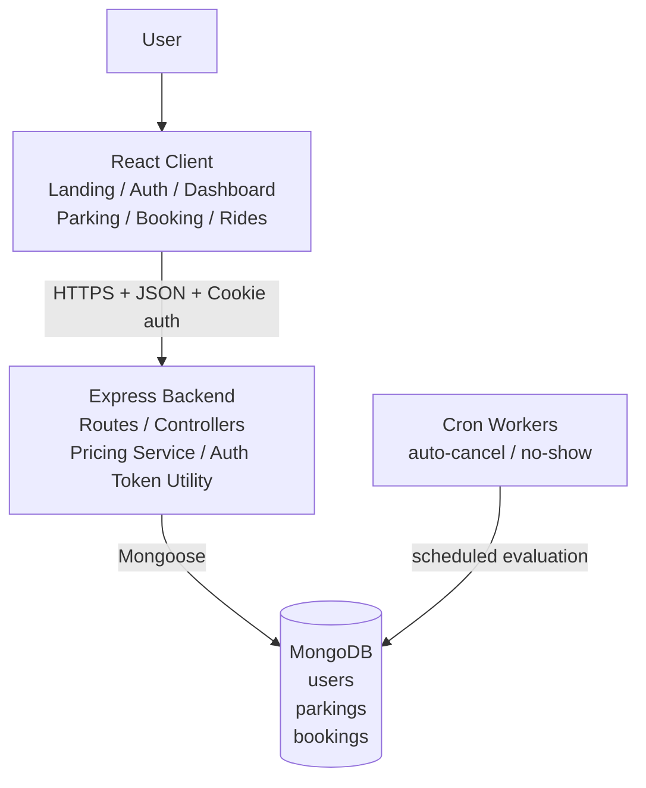
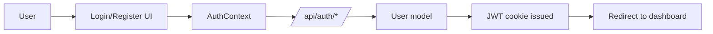
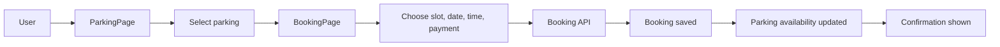
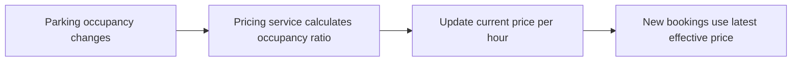
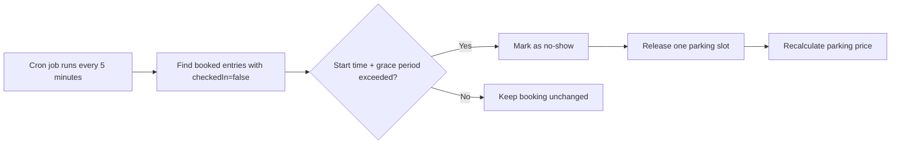
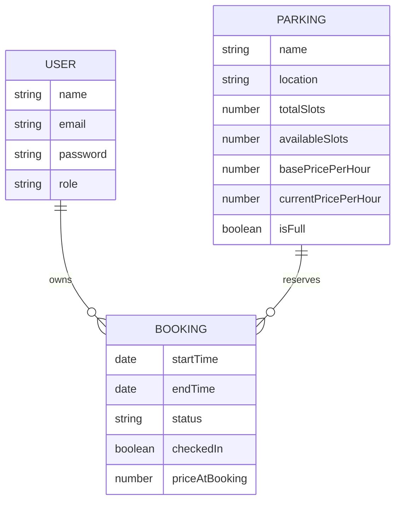

# Park & Ride: Smart Parking and Last-Mile Connectivity

---

## Overview

The product goal is to help commuters:

- discover nearby parking locations
- reserve a parking slot before arrival
- complete a guided booking and payment flow
- manage bookings from a user dashboard
- extend the journey with last-mile ride options

The codebase already implements:

- frontend flows for landing, auth, parking discovery, booking, rides, bookings, and profile
- backend auth APIs for signup, login, and logout
- MongoDB domain models for `User`, `Parking`, and `Booking`
- pricing logic based on parking occupancy
- a cron job design for converting missed check-ins into `no-show`

## Tech Stack

| Layer | Technology |
| --- | --- |
| Frontend | React, React Router, Vite, Tailwind CSS, Framer Motion |
| Backend | Node.js, Express.js |
| Database | MongoDB with Mongoose |
| Authentication | JWT stored in HTTP-only cookie |
| Scheduling | Cron worker design present in codebase; package wiring still pending |
| UI | Custom component library under `client/src/components/ui` |

## Repository Structure

```text
client/
  src/
    components/        Reusable UI and feature components
    context/           Auth state management
    lib/               Mock data, helpers, animations
    pages/             Public pages and dashboard screens

server/
  config/              Database connection
  controller/          Route handlers
  modules/             Mongoose models
  routes/              Express routers
  services/            Business logic such as dynamic pricing
  corn/                Scheduled jobs
```

## High Level Design

### Architecture Style

The system follows a layered client-server architecture:

1. React client renders public and authenticated user experiences.
2. Express backend exposes REST APIs and handles authentication/business rules.
3. MongoDB persists users, parking inventory, and reservations.
4. Background cron jobs enforce delayed operational rules such as no-show handling.

### High Level Components



---

### End-to-End Flow

#### 1. Authentication Flow



---

#### 2. Parking Reservation Flow



---

### High Level Components


---

### End-to-End Flow

#### 1. Authentication Flow


---

#### 2. Parking Reservation Flow


---

#### 3. Dynamic Pricing Flow



---

#### 4. No-Show Handling Flow



## Low Level Design

### Frontend Components

#### Application Shell

- `client/src/App.jsx`
  Handles routing, public vs protected pages, guest redirects, and wraps the app with theme and auth providers.
- `client/src/context/AuthContext.jsx`
  Maintains client-side auth state. Right now it uses mock users and `localStorage`, so it represents the UI contract and should later be connected to backend auth APIs.
- `client/src/components/ProtectedRoute.jsx`
  Blocks access to dashboard routes when the user is not authenticated.
- `client/src/pages/dashboard/DashboardLayout.jsx`
  Shared authenticated shell with sidebar, header, notification provider, theme toggle, and user menu/logout.

#### Public Pages

- `LandingPage`
  Entry page explaining the product.
- `LoginPage`
  Accepts credentials and delegates authentication to `AuthContext.login`.
- `RegisterPage`
  Creates a new account through `AuthContext.register`.

#### Parking Discovery Module

- `client/src/pages/dashboard/ParkingPage.jsx`
  Main parking discovery screen with search, price filtering, distance filtering, availability filtering, map/list views, and selected parking state.
- `client/src/components/parking/ParkingCard.jsx`
  Presents each parking option with metadata such as price, distance, and features.
- `client/src/components/parking/MapView.jsx`
  Visual parking selection surface for location-based browsing.
- `client/src/lib/data.js`
  Stores current mock parking inventory used by the frontend until backend APIs are integrated.

Responsibilities:

- filter parking by text, price, distance, and availability
- keep selected parking state
- route the user to the booking flow

#### Booking Module

- `client/src/pages/dashboard/BookingPage.jsx`
  Multi-step reservation flow:
  1. slot selection
  2. date/time selection
  3. payment selection
  4. confirmation and QR placeholder
- `client/src/components/parking/BookingStepper.jsx`
  Step indicator and slot-grid helpers.
- `client/src/components/shared/Notification.jsx`
  Provides feedback on validation, success, and warning events.

Responsibilities:

- validate booking prerequisites
- calculate booking totals
- simulate payment completion
- show confirmation details and booking ID

#### Ride Module

- `client/src/pages/dashboard/RidesPage.jsx`
  Last-mile ride selection screen with pickup/drop entry, ride comparison, booking dialog, and tracking view.
- `client/src/components/rides/RideCard.jsx`
  Displays available ride types.
- `client/src/components/rides/RideTracking.jsx`
  Shows ride tracking state after booking.

Responsibilities:

- Real-time parking booking  
- Smart slot allocation  
- Integrated ride services  

---

## Tech Stack

| Layer        | Technology              |
|--------------|------------------------|
| Frontend     | React.js               |
| Backend      | Node.js, Express.js    |
| Database     | MongoDB                |
| Authentication | JWT (JSON Web Tokens) |
| APIs         | RESTful APIs           |
| Realtime     | Socket.io              |
| Caching      | Redis (Optional)       |
| Maps         | Google Maps API        |

---

## System Architecture

```text
User
  |
  v
Frontend (React.js)
  |
  v
Backend (Node.js + Express.js)
  |
  v
Database (MongoDB)
  |
  v
Response to Client
```
### System Workflows
#### Parking Booking Workflow
```text
User Login or Registration
        |
        v
Search Parking Location
        |
        v
Check Slot Availability
        |
        +---- No ----> Display "No Slots Available"
        |
        v
Select Slot
        |
        v
Make Payment
        |
        v
Booking Confirmation
        |
        v
QR Code Generation
```
### Last-Mile Ride Workflow
```text
Exit Transit Station
        |
        v
Select Ride Type (Cab / Shuttle)
        |
        v
View Available Options
        |
        v
Confirm Booking
        |
        v
Track Ride
        |
        v
Ride Completion
```
### Slot Availability and Allocation
```text
Sensor or System Input
        |
        v
Update Database
        |
        v
Check Slot Status
        |
        +---- Occupied ----> Skip
        |
        v
Allocate Slot
        |
        v
Notify User
```
### Flowchart
```text
users
parkings
bookings
```

### Entity Relationship View



### Suggested Indexes

To support scale and responsiveness:

#### `users`

- unique index on `email`

#### `parkings`

- index on `location`
- index on `isFull`
- compound index on `availableSlots` and `currentPricePerHour` for discovery filters

#### `bookings`

- index on `user`
- index on `parking`
- index on `status`
- compound index on `startTime`, `status`, and `checkedIn` for cron scans and active-booking queries

### Schema Rules and Invariants

- `availableSlots` must always be between `0` and `totalSlots`
- `isFull = true` when `availableSlots === 0`
- `endTime` must be greater than `startTime`
- `priceAtBooking` must remain unchanged after booking creation
- a booking can move from `booked` to `cancelled`, `completed`, or `no-show`
- only bookings with `checkedIn=false` should be considered by no-show automation

## Current State vs Target State

### Currently implemented in code

- auth API endpoints
- MongoDB connection
- user, parking, and booking schemas
- pricing calculation service
- frontend dashboard and booking-related UI flows using mock data

### Not yet connected end-to-end

- frontend auth pages to backend auth APIs
- parking CRUD/discovery APIs
- booking create/list/cancel/check-in APIs
- persisted ride module
- cron job activation and import path cleanup

## Recommended Next Steps

1. Replace mock frontend auth in `AuthContext` with calls to `/api/auth/signup`, `/api/auth/login`, and `/api/auth/logout`.
2. Add parking and booking routes/controllers so the dashboard uses MongoDB-backed data.
3. Normalize model references and naming inconsistencies in `User` and cron imports.
4. Add middleware for JWT verification and authenticated user extraction.
5. Enable the cron worker after aligning import paths and testing slot release behavior.

## Run the Project

### Frontend

```bash
cd client
npm install
npm run dev
```

### Backend

```bash
cd server
npm install
node app.js
```

Note:

- `server/package.json` does not currently define a `dev` or `start` script.
- If you want hot reload, add a script such as `"dev": "nodemon app.js"`.

### Required Backend Environment Variables

Create `server/.env` with:

```env
PORT=5000
MONGO_URI=your_mongodb_connection_string
JWT_SECRET=your_jwt_secret
```

## License

This project is licensed under the MIT License.
